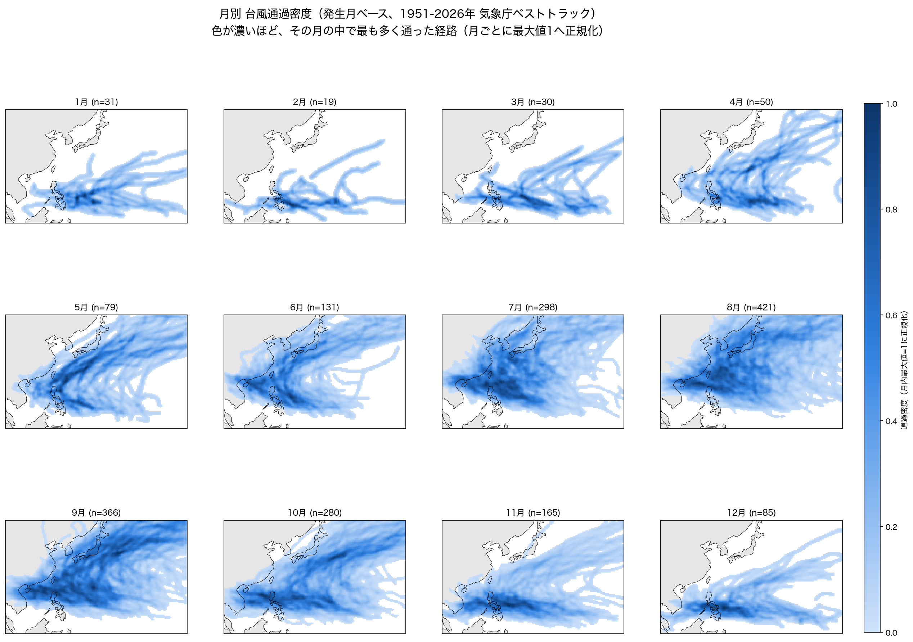
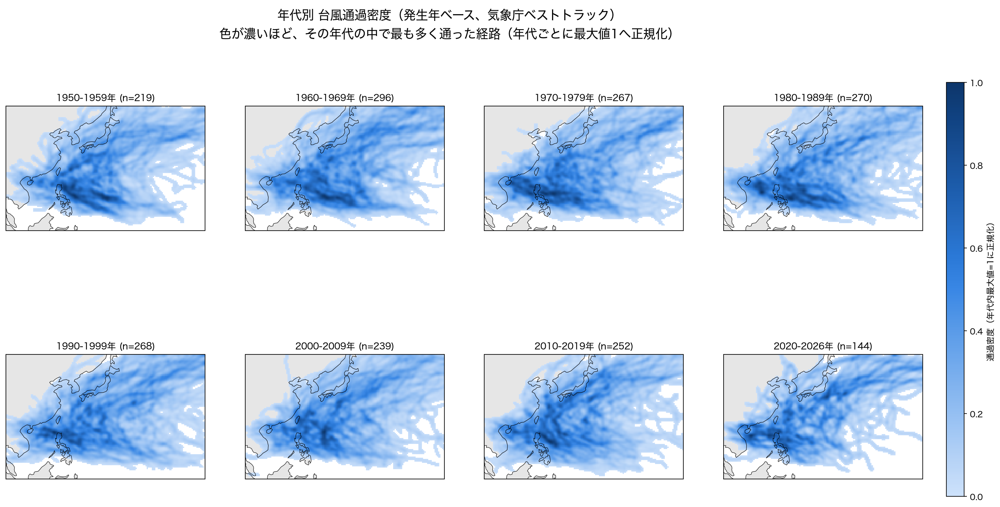
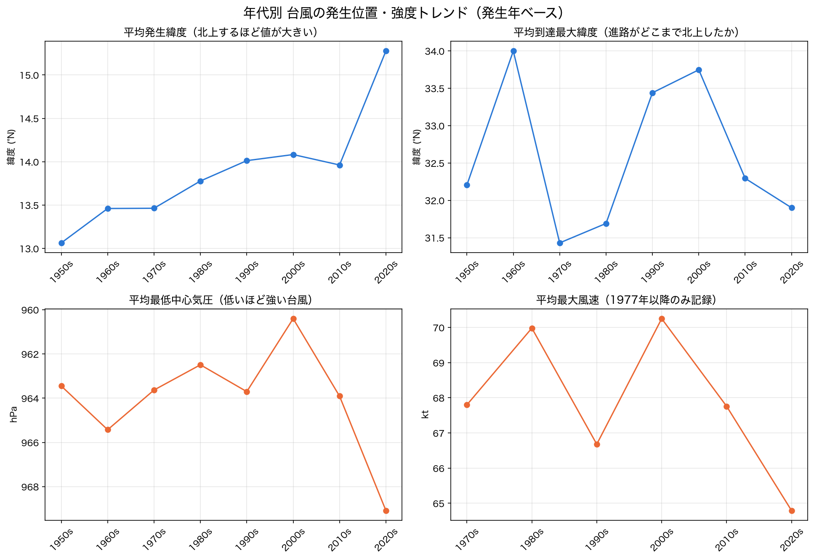
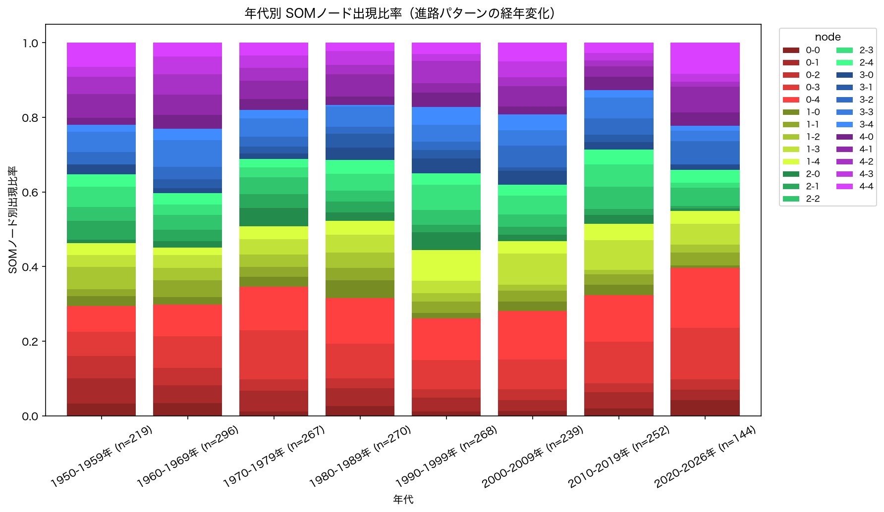

# typhoon_track_dl

気象庁ベストトラックデータを用いて、東アジアにおける台風進路の月毎の傾向を
深層学習（自己組織化マップ等）で探究するプロジェクト。

詳しくは [MANUAL.md](MANUAL.md) / [typhoon-track-dl.md](typhoon-track-dl.md)（pc_docs運用マニュアルのコピー）を参照。

## 概要

- 気象庁RSMC東京の台風ベストトラックデータ（緯度・経度・中心気圧・最大風速の6時間毎時系列、1951年〜現在）を使用。
- 「進路図の画像」ではなく、公式に構造化された数値データを直接扱う方針（詳細は[MANUAL.md](MANUAL.md)参照）。
- Self-Organizing Map（SOM）による教師なしクラスタリングで進路パターンを分類し、
  月ごとの出現傾向を可視化することが本命のアプローチ。
- 実現可能性が未知数の探究的プロジェクトのため、まず古典的な可視化・統計で妥当性を確認してから
  深層学習的手法に進む段階的な進め方を取る。

## 進め方（サマリー）

1. データ取得・前処理（IBTrACS または気象庁ベストトラックテキスト）
2. 月別の目視・統計による傾向確認（ベースライン）
3. SOMによる進路パターンのクラスタリング・月別集計（本命）
4. （発展）系列オートエンコーダとの比較検証

## ディレクトリ構成

```
typhoon_track_dl/
├── README.md          # このファイル
├── CLAUDE.md          # Claude Code向けプロジェクト固有ルール
├── MANUAL.md          # 手法・進め方の詳細
├── requirements.txt   # 依存パッケージ（Phaseごとにコメントで区分）
├── src/
│   ├── download.py          # 気象庁ベストトラックzipのダウンロード
│   ├── parse.py             # 固定長テキストのパース → data/processed/best_track.csv
│   ├── visualize_monthly.py # Phase1: 月別台風トラックの地図可視化
│   ├── visualize_density.py # Phase1補足: 月別台風通過密度ヒートマップ
│   ├── som_cluster.py       # Phase2: SOMによる進路パターンのクラスタリング
│   └── visualize_decadal.py # 追加分析: 10年ごとの経路変化
├── data/
│   ├── raw/            # ダウンロードした生データ（git管理外）
│   └── processed/      # パース済みCSV・SOMノード割当（git管理外）
├── outputs/            # 可視化結果（画像）
└── notebooks/          # 検証用notebook
```

## セットアップ・実行方法

```bash
python3 -m venv .venv
.venv/bin/pip install -r requirements.txt

.venv/bin/python src/download.py          # data/raw/bst_all.txt を取得
.venv/bin/python src/parse.py             # data/processed/best_track.csv を生成
.venv/bin/python src/visualize_monthly.py # outputs/phase1_monthly_tracks.png を生成
.venv/bin/python src/visualize_density.py # outputs/phase1_monthly_density.png を生成
.venv/bin/python src/som_cluster.py       # outputs/phase2_*.png と data/processed/som_assignment.csv を生成
.venv/bin/python src/visualize_decadal.py # outputs/decadal_*.png と data/processed/decadal_stats.csv を生成（som_cluster.py実行後）
```

## Phase1: 月別台風進路（古典的検証）

発生月（最初の観測点の月）ごとに全台風のトラックを東アジア地図に重ね書きした結果:


既知の季節傾向とよく整合することを確認:
- **7-8月**（台風数最多期）: 太平洋高気圧の縁を回るように日本近海へ直進する経路が密集。
- **9-10月**: フィリピン近海で発生し、偏西風帯に入って東へ再カーブする経路が明瞭に増加。
- **11-3月**（台風数最少期）: 発生位置が低緯度側にシフトし、日本まで北上せず南シナ海方面へ
  向かう経路が主流。

上の重ね書き図は線が多いほど濃く見えるが定量的ではないため、月ごとに通過地点を
グリッド集計し、最も多く通った経路を色の濃淡で示したのが以下の図（月内最大値を1に正規化）:



- **1-2月・11-12月**: フィリピン近海から中国大陸方面へ西進する経路が最頻出。
- **7-9月**: 日本近海を北上する経路が最も濃く、最頻出パターンが明確に北へシフト。
- **10月**: フィリピン近海の西進経路がなお濃いが、日本近海への北上経路も並んで現れる
  （季節の遷移期）。

## Phase2: SOMクラスタリング（本命）

台風ごとの緯度経度時系列を20点に等間隔リサンプリングして特徴ベクトル化し、
5×5のSOM（MiniSom）で教師なしクラスタリングした。

**ノード別代表経路**（緑=発生、赤=消滅/終端。枠色は下図の積み上げ棒グラフの配色と対応）:


SOMグリッド上で左上（短い直進型）→右下（強い再カーブ型）へと連続的なグラデーションが
現れ、`node(0,0)`〜`node(4,4)`が「発生位置の南北」「進路の直進度／再カーブ度」という
解釈可能な2軸に沿って整列していることを確認。

**月別ノード出現比率**:


Phase1の季節傾向と整合:
- **1-2月・11-12月**: 赤系（短い直進型、あまり北上しない）が支配的。
- **6-7月**: 黄緑〜緑系（直進〜中程度カーブ）が主体。
- **8-9月**: 青〜紫系（強い再カーブ型）が増加。

## 追加分析: 10年ごとの経路の変化

月別傾向とは別軸で、年代（発生年の10年区切り）ごとに経路パターンが変化しているかを調べた。
2020年代は2020-2026年の7年分のみ（他は10年分）とサンプル期間が短い点に注意。

**年代別通過密度**（月別と同じ手法、年代ごとに最大値1へ正規化）:



**年代別トレンド**（台風ごとの発生位置・到達緯度・最盛期強度を年代平均）:



**年代別SOMノード出現比率**（進路パターンの構成比の推移）:



分かったこと:
- **経路の基本形（直進型 vs 再カーブ型の構成比）は年代を通じて大きくは変わらない**。
  SOMノード出現比率は年代間で緩やかにしか動いていない。
- **発生位置は緩やかに北上・西偏する傾向**。平均発生緯度は1950年代13.1°N→2000年代
  14.1°Nまで緩やかに上昇し、2020年代（直近7年）は15.3°Nへ急上昇。平均発生経度も
  141.7°E→136.7°Eへ西偏。
- 一方、**平均到達最大緯度（どこまで北上したか）には明確な単調トレンドがない**
  （年代ごとに31.4〜34.0°Nの間でばらつく）。
- **平均強度（最低中心気圧・最大風速）にも明確な単調トレンドはなく**、2020年代は
  むしろ平均的にやや弱い（最低気圧969hPa、最大風速64.8kt、いずれも記録期間中で最弱）。

解釈上の注意（過大評価しないための留保）:
- 2020年代はサンプル期間が7年と短く、他の年代（10年、n≈250）よりデータ数が
  少ないため統計的変動が大きく出やすい。この年代の急な変化を「確定的な気候トレンド」
  と断定するのは早計。
- 1950-60年代は気象衛星「ひまわり」運用開始（1977年）以前のデータで、外洋上の
  弱い熱帯低気圧の捕捉率が低かった可能性があり、年代間の単純比較には観測体制の
  変化によるバイアスが混じりうる。最大風速も1977年以降のみ記録。
- 総じて、今回のデータからは「台風の勢力を維持したまま北上する事例が増えている」
  といった強い主張はできず、「発生位置がやや北上・西偏している」という緩やかな
  傾向にとどまる。

## ステータス

2026-07-26 Phase2（SOMクラスタリング）完了。月別ノード出現比率がPhase1の
季節傾向と整合することを確認。次は Phase3（発展・系列オートエンコーダとの比較検証）
だが、現時点でSOMによる分類は十分に解釈可能な結果を示しているため、
Phase3に進むかは要検討。

2026-07-26 Phase1（古典的検証）完了。月別台風進路の可視化が既知の季節傾向と
整合することを確認したため、Phase2（SOMクラスタリング）に進める見込み。

2026-07-26 Phase0（データ取得・前処理）実装完了。
気象庁RSMC東京のベストトラック全期間データ（1951〜2026年、台風1955個・
観測点71223件）をダウンロード・パースするスクリプトを実装。
令和元年東日本台風（HAGIBIS, 国際番号1919）の最盛期記録
（中心気圧915hPa・最大風速105kt）が気象庁公表値と一致することを確認済み。
